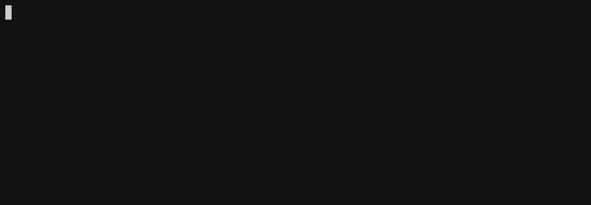

# Borderlands Shift Code Redeemer

Automatically redeem Borderlands Shift codes from the wonderful website http://ticklemezombie.com/shift.

### Supported Games:

- Borderlands GOTY
- Borderlands 2
- Borderlands: The Pre-Sequel
- Borderlands 3

### Supported Platforms:

- Steam
- PSN
- Xbox Live
- Epic

## Requirements

1. NodeJS v10+

## Usage

1. Start the program: `npx shift-code-redeemer`
1. Enter your shift credentials.
1. Select the platform and game you wish to redeem on.
1. Codes will be automatically redeemed. Just let it do its thing.
    - Used shift keys are cached in `~/.config/configstore/shift-code-redeemer.json` under the profile email.

### Optional arguments

Use the following arguments to redeem codes faster, or even unattended.

`--email=EMAIL`: replace `EMAIL` with your email address to skip the login prompt. You must use this with `--password`.
`--password=PASSWORD`: replace `PASSWORD` with your password to skip the login prompt. You must use this with `--email`.
`--platform=PLATFORM`: replace `PLATFORM` with the platform for which you want to redeem, by one of the following codes:
    `steam`
    `psn`
    `xbox`
    `epic`
`--games=GAME`: replace `GAME` with game you want to redeem, by one of the following codes:
    `1`: Borderlands: Game of the Year
    `2`: Borderlands 2
    `tps`: Borderlands: The Pre-Sequel
    `3`: Borderlands 3

## FAQ

1. What does `"please launch a shift-enabled title first"` mean?
    - You can only redeem a certain number of SHiFT codes within time window before you'll see this. It means you need to open a SHiFT enabled title (a Borderlands game) and play past the main menu. Once you're loaded in, you can exit the game and continue redeeming. You may also wait at least an hour and try again.
